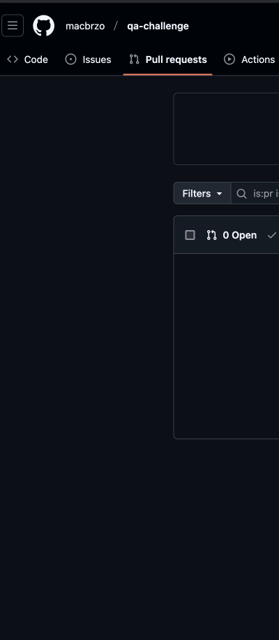

# QA-UI-Challenge

## Description
A brief description of your project and its purpose.

---

## Installation

1. **Clone the repository:**

   ```bash
   git clone https://github.com/macbrzo/qa-challenge
   cd qa-challenge
   ```
2. **Install Poetry:**

    Follow the official Poetry installation guide if Poetry is not already installed.

3. **Install dependencies:**
   ```bash
    poetry install
   ```

## Usage

1. **Activate the virtual environment:**

   ```bash
   poetry shell
   ```
2. **Run automation:**

    ```bash
   pytest -n auto
   ```

## Demo

